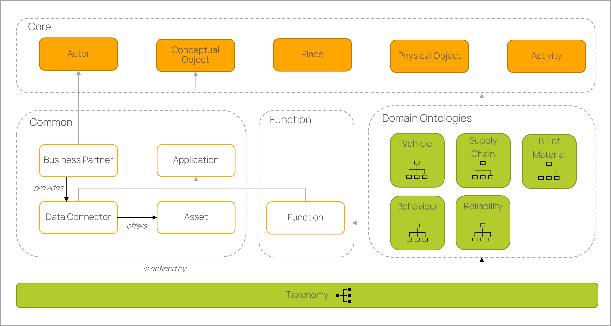

<!--
# Copyright (c) 2024 Contributors to the Eclipse Foundation
#
# See the NOTICE file(s) distributed with this work for additional
# information regarding copyright ownership.
#
# This work is made available under the terms of the 
# Creative Commons Attribution 4.0 International (CC-BY-4.0) license, 
# which is available at
# https://creativecommons.org/licenses/by/4.0/legalcode.
#
# SPDX-License-Identifier: CC-BY-4.0
-->

# Ontology Models to realize federated query

- This repository hosts ontologies based on the [CX - 0067 Ontology Models to realize federated query in Catena-X v.1.1.0](https://catenax-ev.github.io/docs/next/standards/CX-0067-OntologyModelsToRealizeFederatedQueryInCatenaX) standard to realize [Knowledge Agent](https://eclipse-tractusx.github.io/docs-kits/kits/knowledge-agents/adoption-view/intro) applications.
- The Catena-X Ontology and its initial Catena-X Taxonomy are not intended to be a world model. Instead, it is intended to be an integrative framework with a focus on automotive manufacturing. Therefore, our focus is on defining practical domain ontologies. All definitions in a domain ontology should belong to the same namespace (which is the technical key of the domain) and should use a common prefix. Domain ontologies can refer to classes of other domains by importing concrete versions.
- The Catena-X taxonomy contains all concepts used in domain ontologies. Furthermore, the defined concepts are not only used in the knowledge agent approach, but are also made available to all Catena-X applications.
 

  

## Ontology Development

<!-- & Governance Process -->
<!-- The ontologies can be developed based on the ontology governance process.! -->
- The ontologies are developed using the [protégé editor](https://protege.stanford.edu/). Therefore, we recommend to use this editor.
- After the development of a new ontology is finished, the documentation is automatically generated as a Markdown file and stored in the repository. In addition, the ontologies are published at [w3id.org Catena-X](https://w3id.org/catenax). This also allows access to all versions.

## Provisioning of Ontology and Taxanomy

- The ontologies/taxonomies are provided as individual domain files and are simultaneously available as a merged Catena-X ontology/taxonomy in the root directory.

## Implemented Ontologies

Main ontologies:

- [Core Ontology](docs/core_ontology.md)
- [Common Ontology](docs/common_ontology.md)
- [Function Ontology](docs/function_ontology.md)

Domain ontologies:
- [Bill of Material](docs/bill-of-material_ontology.md)
- [Behaviour](docs/behaviour_ontology.md)
- [Supply Chain Ontology](docs/supply-chain_ontology.md)
- [Reliability](docs/reliability_ontology.md)
- [Vehicle Ontology](docs/vehicle_ontology.md)

Taxonomy:
- [Core Taxonomy](docs/core_taxonomy.md)
- [Asset Taxonomy](docs/asset_taxonomy.md)

Dependencies
- [Requirements](ontology_tools/requirements.txt)

