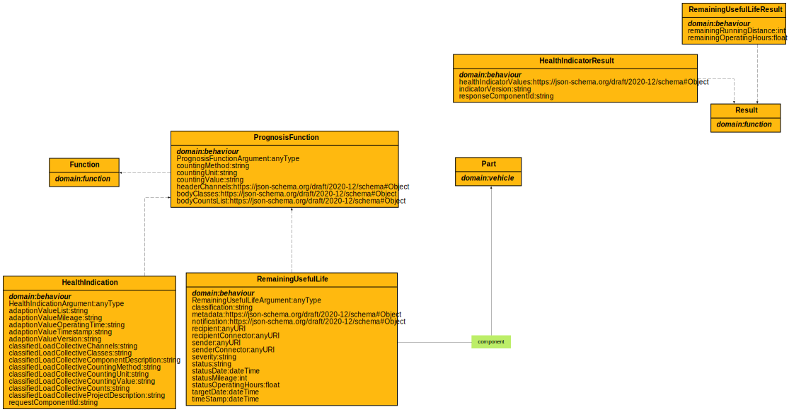

# Behaviour Ontology

**Title:**  Behaviour Ontology

**Description:**  Ontology for behaviour predictions.

**Creator:**  Christoph Jung

**Contributor:**  Oguzhan Balandi

**Date:**  2023-07-04

**Version:**  1.9.4  
  
  

## Classes
  

|Name|Description|Datatype properties|Object properties|Subclass of|
| :--- | :--- | :--- | :--- | :--- |

## Data Properties
  

|Name|Description|Domain|Range|Subproperty of|
| :--- | :--- | :--- | :--- | :--- |

## Object Properties
  

|Name|Descriptions|Domain|Range|Subproperty of|
| :--- | :--- | :--- | :--- | :--- |
