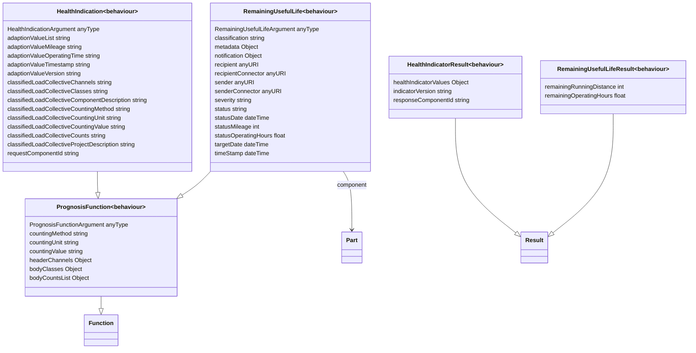

# Behaviour Ontology

**Title:**  Behaviour Ontology

**Description:**  The Behaviour Ontology is an implementation of the Function Ontology for behaviour predictions. It contains prognosis functions for specific vehicle parts.

**Creator:**  [@drcgjung](https://github.com/drcgjung)

**Contributor:**  [@obalandi](https://github.com/obalandi)

**Date:**  2023-07-04

**Version:**  1.9.5

**Imports:**  file:function_ontology.ttl , file:vehicle_ontology.ttl 

**Link to ontology:**  https://w3id.org/catenax/ontology/behaviour  

## Classes
  

|Name|Description|Datatype properties|Object properties|Subclass of|
| :--- | :--- | :--- | :--- | :--- |
|PrognosisFunction|Super class of prognosis functions.|[PrognosisFunctionArgument](#PrognosisFunctionArgument) , [countingMethod](#countingMethod) , [countingUnit](#countingUnit) , [countingValue](#countingValue) , [headerChannels](#headerChannels) , [bodyClasses](#bodyClasses) , [bodyCountsList](#bodyCountsList) ||[Function](./function_ontology.md#Function) |
|HealthIndication|Health Indication is an evaluation function operating on batches of load collectives and adaptive values.|[HealthIndicationArgument](#HealthIndicationArgument) , [adaptionValueList](#adaptionValueList) , [adaptionValueMileage](#adaptionValueMileage) , [adaptionValueOperatingTime](#adaptionValueOperatingTime) , [adaptionValueTimestamp](#adaptionValueTimestamp) , [adaptionValueVersion](#adaptionValueVersion) , [classifiedLoadCollectiveChannels](#classifiedLoadCollectiveChannels) , [classifiedLoadCollectiveClasses](#classifiedLoadCollectiveClasses) , [classifiedLoadCollectiveComponentDescription](#classifiedLoadCollectiveComponentDescription) , [classifiedLoadCollectiveCountingMethod](#classifiedLoadCollectiveCountingMethod) , [classifiedLoadCollectiveCountingUnit](#classifiedLoadCollectiveCountingUnit) , [classifiedLoadCollectiveCountingValue](#classifiedLoadCollectiveCountingValue) , [classifiedLoadCollectiveCounts](#classifiedLoadCollectiveCounts) , [classifiedLoadCollectiveProjectDescription](#classifiedLoadCollectiveProjectDescription) , [requestComponentId](#requestComponentId) ||[PrognosisFunction](#PrognosisFunction) |
|HealthIndicatorResult|Health Indicator is part of a indicator batch.|[healthIndicatorValues](#healthIndicatorValues) , [indicatorVersion](#indicatorVersion) , [responseComponentId](#responseComponentId) ||[Result](./function_ontology.md#Result) |
|RemainingUsefulLife|Remaining Useful Life is a Prediction of the Estimated Mileage/Runtime until a Breakdown.|[RemainingUsefulLifeArgument](#RemainingUsefulLifeArgument) , [classification](#classification) , [metadata](#metadata) , [notification](#notification) , [recipient](#recipient) , [recipientConnector](#recipientConnector) , [sender](#sender) , [senderConnector](#senderConnector) , [severity](#severity) , [status](#status) , [statusDate](#statusDate) , [statusMileage](#statusMileage) , [statusOperatingHours](#statusOperatingHours) , [targetDate](#targetDate) , [timeStamp](#timeStamp) |[component](#component) |[PrognosisFunction](#PrognosisFunction) |
|RemainingUsefulLifeResult|The asynchronous notification response.|[remainingRunningDistance](#remainingRunningDistance) , [remainingOperatingHours](#remainingOperatingHours) ||[Result](./function_ontology.md#Result) |

## Data Properties
  

|Name|Description|Domain|Range|Subproperty of|
| :--- | :--- | :--- | :--- | :--- |
|PrognosisFunctionArgument|Super property of prognosis funtion arguments|[PrognosisFunction](#PrognosisFunction) |xsd:anyType |[argument](./function_ontology.md#argument) |
|countingMethod|Counting Method of Load Spectrum.|[PrognosisFunction](#PrognosisFunction) |xsd:string |[prognosisFunctionArgument](#prognosisFunctionArgument) |
|countingUnit|Counting Unit of Load Spectrum.|[PrognosisFunction](#PrognosisFunction) |xsd:string |[prognosisFunctionArgument](#prognosisFunctionArgument) |
|countingValue|Counting Value Name of Load Spectrum.|[PrognosisFunction](#PrognosisFunction) |xsd:string |[prognosisFunctionArgument](#prognosisFunctionArgument) |
|headerChannels|Channels of Load Spectrum.|[PrognosisFunction](#PrognosisFunction) |json:Object |[prognosisFunctionArgument](#prognosisFunctionArgument) |
|bodyClasses|Classes of Load Spectrum.|[PrognosisFunction](#PrognosisFunction) |json:Object |[prognosisFunctionArgument](#prognosisFunctionArgument) |
|bodyCountsList|Counts List of Load Spectrum.|[PrognosisFunction](#PrognosisFunction) |json:Object |[prognosisFunctionArgument](#prognosisFunctionArgument) |
|HealthIndicationArgument|Super property of health indication function arguments.|[HealthIndication](#HealthIndication) |xsd:anyType |[PrognosisFunctionArgument](#PrognosisFunctionArgument) |
|adaptionValueList|A Health Indicator Adaption needs an array of adaption values.|[HealthIndication](#HealthIndication) |xsd:string |[HealthIndicationArgument](#HealthIndicationArgument) |
|adaptionValueMileage|A Health Indicator Adaption needs a mileage of the embedding vehicle.|[HealthIndication](#HealthIndication) |xsd:string |[HealthIndicationArgument](#HealthIndicationArgument) |
|adaptionValueOperatingTime|A Health Indicator Adaption needs an operating time of the embedding vehicle.|[HealthIndication](#HealthIndication) |xsd:string |[HealthIndicationArgument](#HealthIndicationArgument) |
|adaptionValueTimestamp|A Health Indicator Adaption needs a timestamp.|[HealthIndication](#HealthIndication) |xsd:string |[HealthIndicationArgument](#HealthIndicationArgument) |
|adaptionValueVersion|A Health Indicator Adaption needs a version.|[HealthIndication](#HealthIndication) |xsd:string |[HealthIndicationArgument](#HealthIndicationArgument) |
|classifiedLoadCollectiveChannels|A Load Collective has descriptors for all channels.|[HealthIndication](#HealthIndication) |xsd:string |[HealthIndicationArgument](#HealthIndicationArgument) |
|classifiedLoadCollectiveClasses|A Load Collective has a body with the class indices.|[HealthIndication](#HealthIndication) |xsd:string |[HealthIndicationArgument](#HealthIndicationArgument) |
|classifiedLoadCollectiveComponentDescription|A Load Collective has a component description.|[HealthIndication](#HealthIndication) |xsd:string |[HealthIndicationArgument](#HealthIndicationArgument) |
|classifiedLoadCollectiveCountingMethod|A Load Collective has a method for the counting dimension.|[HealthIndication](#HealthIndication) |xsd:string |[HealthIndicationArgument](#HealthIndicationArgument) |
|classifiedLoadCollectiveCountingUnit|A Load Collective has a unit for the counting dimension.|[HealthIndication](#HealthIndication) |xsd:string |[HealthIndicationArgument](#HealthIndicationArgument) |
|classifiedLoadCollectiveCountingValue|A Load Collective has a value for the counting dimension.|[HealthIndication](#HealthIndication) |xsd:string |[HealthIndicationArgument](#HealthIndicationArgument) |
|classifiedLoadCollectiveCounts|A Load Collective has a body with the raw measurements.|[HealthIndication](#HealthIndication) |xsd:string |[HealthIndicationArgument](#HealthIndicationArgument) |
|classifiedLoadCollectiveProjectDescription|A Load Collective has a project description.|[HealthIndication](#HealthIndication) |xsd:string |[HealthIndicationArgument](#HealthIndicationArgument) |
|requestComponentId|A Health Indicator Input relates to a component.|[HealthIndication](#HealthIndication) |xsd:string |[HealthIndicationArgument](#HealthIndicationArgument) |
|RemainingUsefulLifeArgument|Super property of remaining useful life function arguments.|[RemainingUsefulLife](#RemainingUsefulLife) |xsd:anyType |[PrognosisFunctionArgument](#PrognosisFunctionArgument) |
|classification|Classification of the notification.|[RemainingUsefulLife](#RemainingUsefulLife) |xsd:string |[RemainingUsefulLifeArgument](#RemainingUsefulLifeArgument) |
|metadata|Additional Metadata of the Loadspectrum.|[RemainingUsefulLife](#RemainingUsefulLife) |json:Object |[RemainingUsefulLifeArgument](#RemainingUsefulLifeArgument) |
|notification|An optional notification output template.|[RemainingUsefulLife](#RemainingUsefulLife) |json:Object |[RemainingUsefulLifeArgument](#RemainingUsefulLifeArgument) |
|recipient|Recipient of the notification as a BPN.|[RemainingUsefulLife](#RemainingUsefulLife) |xsd:anyURI |[RemainingUsefulLifeArgument](#RemainingUsefulLifeArgument) |
|recipientConnector|Recipient Address of the notification as a URL.|[RemainingUsefulLife](#RemainingUsefulLife) |xsd:anyURI |[RemainingUsefulLifeArgument](#RemainingUsefulLifeArgument) |
|sender|Sender of the notification as a BPN.|[RemainingUsefulLife](#RemainingUsefulLife) |xsd:anyURI |[RemainingUsefulLifeArgument](#RemainingUsefulLifeArgument) |
|senderConnector|Sender Address of the notification as a URL.|[RemainingUsefulLife](#RemainingUsefulLife) |xsd:anyURI |[RemainingUsefulLifeArgument](#RemainingUsefulLifeArgument) |
|severity|Severity of the notification.|[RemainingUsefulLife](#RemainingUsefulLife) |xsd:string |[RemainingUsefulLifeArgument](#RemainingUsefulLifeArgument) |
|status|Status of the notification.|[RemainingUsefulLife](#RemainingUsefulLife) |xsd:string |[RemainingUsefulLifeArgument](#RemainingUsefulLifeArgument) |
|statusDate|Time of Recording.|[RemainingUsefulLife](#RemainingUsefulLife) |xsd:dateTime |[RemainingUsefulLifeArgument](#RemainingUsefulLifeArgument) |
|statusMileage|Mileage of Component at Time of Recording.|[RemainingUsefulLife](#RemainingUsefulLife) |xsd:int |[RemainingUsefulLifeArgument](#RemainingUsefulLifeArgument) |
|statusOperatingHours|Operating Hours of Target Component at Time of Recording.|[RemainingUsefulLife](#RemainingUsefulLife) |xsd:float |[RemainingUsefulLifeArgument](#RemainingUsefulLifeArgument) |
|targetDate|Target Date of the notification.|[RemainingUsefulLife](#RemainingUsefulLife) |xsd:dateTime |[RemainingUsefulLifeArgument](#RemainingUsefulLifeArgument) |
|timeStamp|Timestamp of the notification.|[RemainingUsefulLife](#RemainingUsefulLife) |xsd:dateTime |[RemainingUsefulLifeArgument](#RemainingUsefulLifeArgument) |
|remainingRunningDistance|Predicted Distance of Remaining Useful Life Response|[RemainingUsefulLifeResult](#RemainingUsefulLifeResult) |xsd:int |[returnValue](./function_ontology.md#returnValue) |
|remainingOperatingHours|Predicted Operating Hours of Remaining Useful Life Response|[RemainingUsefulLifeResult](#RemainingUsefulLifeResult) |xsd:float |[returnValue](./function_ontology.md#returnValue) |
|healthIndicatorValues|Health Indicator Values are percentages.|[HealthIndicatorResult](#HealthIndicatorResult) |json:Object |[returnValue](./function_ontology.md#returnValue) |
|indicatorVersion|Version of the health indicator prognosis.|[HealthIndicatorResult](#HealthIndicatorResult) |xsd:string |[returnValue](./function_ontology.md#returnValue) |
|responseComponentId|Component Id of the health indicator prognosis.|[HealthIndicatorResult](#HealthIndicatorResult) |xsd:string |[returnValue](./function_ontology.md#returnValue) |

## Object Properties
  

|Name|Descriptions|Domain|Range|Subproperty of|
| :--- | :--- | :--- | :--- | :--- |
|component|Component of the Predicition.|[RemainingUsefulLife](#RemainingUsefulLife) |[Part](./vehicle_ontology.md#Part) ||
