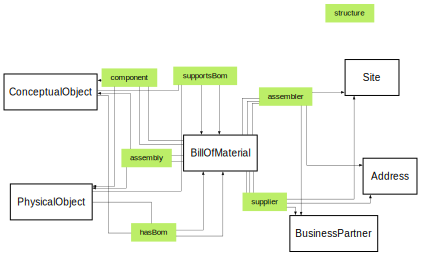

# Bill Of Material Ontology


**Title:**  Bill Of Material Ontology

**Description:**  Ontology for bills of material.

**Creator:**  [@drcgjung](https://github.com/drcgjung)

**Contributor:**  [@obalandi](https://github.com/obalandi), [@ZazraltMagic](https://github.com/ZazraltMagic)

**Date:**  2023-09-08

**Version:**  0.10.3

**Imports:**  file:core_ontology.ttl , file:common_ontology.ttl 

**Link to ontology:**  https://w3id.org/catenax/ontology/bill-of-material  
  
  

## Data Properties
  

|Name|Description|Domain|Range|Subproperty of|
| :--- | :--- | :--- | :--- | :--- |
|<span id="quantity">quantity</span>|None|[BillOfMaterial](#BillOfMaterial) |||
|<span id="quantityMeasure">quantityMeasure</span>|None|[BillOfMaterial](#BillOfMaterial) |xsd:float |[quantity](#quantity) |
|<span id="quantityUnit">quantityUnit</span>|None|[BillOfMaterial](#BillOfMaterial) |http://www.w3.org/1999/02/22-rdf-syntax-ns#resource |[quantity](#quantity) |
|<span id="validityPeriod">validityPeriod</span>|None|[BillOfMaterial](#BillOfMaterial) |||
|<span id="validityPeriodStart">validityPeriodStart</span>|None|[BillOfMaterial](#BillOfMaterial) |xsd:date |[validityPeriod](#validityPeriod) |
|<span id="validityPeriodEnd">validityPeriodEnd</span>|None|[BillOfMaterial](#BillOfMaterial) |xsd:date |[validityPeriod](#validityPeriod) |

## Object Properties
  

|Name|Descriptions|Domain|Range|Subproperty of|
| :--- | :--- | :--- | :--- | :--- |
|<span id="structure">structure</span>|None|[BillOfMaterial](#BillOfMaterial) |||
|<span id="component">component</span>|None|[BillOfMaterial](#BillOfMaterial) |[PhysicalObject](./core_ontology.md#PhysicalObject) , [ConceptualObject](./core_ontology.md#ConceptualObject) |[structure](#structure) |
|<span id="assembly">assembly</span>|None|[BillOfMaterial](#BillOfMaterial) |[PhysicalObject](./core_ontology.md#PhysicalObject) , [ConceptualObject](./core_ontology.md#ConceptualObject) |[structure](#structure) |
|<span id="hasBom">hasBom</span>|None|[PhysicalObject](./core_ontology.md#PhysicalObject) , [ConceptualObject](./core_ontology.md#ConceptualObject) |[BillOfMaterial](#BillOfMaterial) ||
|<span id="supportsBom">supportsBom</span>|None|[PhysicalObject](./core_ontology.md#PhysicalObject) , [ConceptualObject](./core_ontology.md#ConceptualObject) |[BillOfMaterial](#BillOfMaterial) ||
|<span id="supplier">supplier</span>|None|[BillOfMaterial](#BillOfMaterial) |[BusinessPartner](./common_ontology.md#BusinessPartner) , [Site](./common_ontology.md#Site) , [Address](./common_ontology.md#Address) ||
|<span id="assembler">assembler</span>|None|[BillOfMaterial](#BillOfMaterial) |[BusinessPartner](./common_ontology.md#BusinessPartner) , [Site](./common_ontology.md#Site) , [Address](./common_ontology.md#Address) ||


```python
import Mdutils


mdFile = MdUtils(file_name='Example_Markdown',title='Markdown File Example')
mdFile.create_md_file()
```