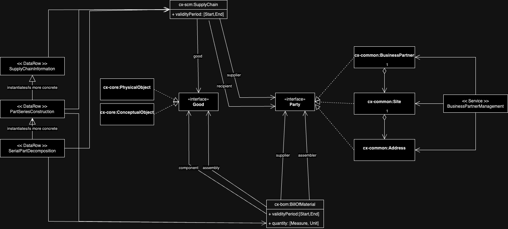

<!--
 * Copyright (c) 2022,2023 Contributors to the Catena-X Association
 *
 * See the NOTICE file(s) distributed with this work for additional
 * information regarding copyright ownership.
 *
 * This program and the accompanying materials are made available under the
 * terms of the Apache License, Version 2.0 which is available at
 * https://www.apache.org/licenses/LICENSE-2.0.
 *
 * Unless required by applicable law or agreed to in writing, software
 * distributed under the License is distributed on an "AS IS" BASIS, WITHOUT
 * WARRANTIES OR CONDITIONS OF ANY KIND, either express or implied. See the
 * License for the specific language governing permissions and limitations
 * under the License.
 *
 * SPDX-License-Identifier: Apache-2.0
-->
# Supply and Bill-Of-Material Chains

There are two domain ontologies which cater for the representation of product chains ([Bill Of Material Ontology](../bill-of-material_ontology.ttl)) and supply chains ([Supply Chain Ontology](../supply-chain_ontology.ttl)).

Both ontologies try to be very abstract about the kind of products (Conceptual or Physical Objects, see the [Core Ontology](core_ontology.md)) being assembled or the economical good being supplied. Here you can plug in any taxonomical resource such as provided/required by various use cases, see the [Ontology Modelling Rules](ontology_modelling_rules.md)).

Both ontologies introduce/describe "relational entities" (association or reification nodes which build the chain elements) which associate a supplier (a Business Partner as a legal person, one of its Sites or even a concrete Address of one of its Sites (see [Common Ontology](common_ontology.md)) with a recipient or assembler (a Business Partner, a Site or an Address).  

The ontologies are built with compatible and increasingly more detailed schemas such that many heterogenous data sources (serial part information, construction information, supply information) can be mapped to them simultaneously. 

For example, a single row in a serial part decomposition database view can thus be used as
- a concrete BOM for the assembly of the serialised part
- a construction BOM for the part series
- an SCM log for the serialised components
- a general SCM blueprint for the part construction

By combining the data sources with a (central) business partner data management service, this increases the stability of building complete chains over federated data sources.

### Supply Chain

* **Description:**
The Supply Chain relates consumers and a supplier.

* **Properties:**	
    * **validityPeriod:** Validity information.
      * **validityPeriodStart:** Validity Period Start .
      * **validityPeriodEnd:** Validity Period End.
    * **good:** The economocial good being chained. Can be an abstract description in a material taxonomy.
    * **supplier:** The supplier of the component(s).
    * **recipient:** The assembler of the assembly.

### Bill Of Material

* **Description:**
The Bill Of Material relates qualitatively and quantitatively Assembly Parts to their Components.

* **Properties:**	
    * **quantity:** Quantity information.
      * **quantityMeasure:** The measure of quantity that a component contributes to an assymbly in a bill of material .
      * **quantityUnit:** The unit of quantity that a component contributes to an assymbly in a bill of material .
    * **validityPeriod:** Validity information.
      * **validityPeriodStart:** Validity Period Start .
      * **validityPeriodEnd:** Validity Period End.
    * **structure:** Assembly information.
      * **component:** Lists the components of a bill of material.
      * **assembly:** Refers the assembly of a bill of material.
    * **supplier:** The supplier of the component(s).
    * **assembler:** The assembler of the assembly.

