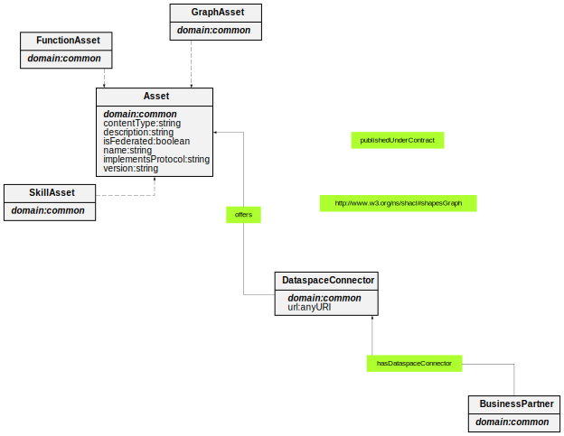

# Common Ontology

**Title:**  Common Ontology

**Description:**  The common ontology describes the Dataspace connectors in detail. On the one hand, this includes the information from which Catena-X business partner the connectors are deployed. On the other hand, with which contracts which assets provide the connectors.

**Creator:**  Zazralt Magic

**Contributor:**  Oguzhan Balandi

**Date:**  2023-05-23

**Version:**  1.9.4

**Imports:**  None

**Link to ontology:**  https://w3id.org/catenax/ontology/common  
  
  

## Classes
  

|Name|Description|Datatype properties|Object properties|Subclass of|
| :--- | :--- | :--- | :--- | :--- |
|Asset|None|[contentType](#contentType) , [description](#description) , [isFederated](#isFederated) , [name](#name) , [implementsProtocol](#implementsProtocol) , [version](#version) |[publishedUnderContract](#publishedUnderContract) , [http://www.w3.org/ns/shacl#shapesGraph](#http://www.w3.org/ns/shacl#shapesGraph) ||
|BusinessPartner|None||[hasDataspaceConnector](#hasDataspaceConnector) ||
|DataspaceConnector|None|[url](#url) |[offers](#offers) ||
|FunctionAsset|None|||[Asset](#Asset) |
|GraphAsset|None|||[Asset](#Asset) |
|SkillAsset|None|||[Asset](#Asset) |

## Data Properties
  

|Name|Description|Domain|Range|Subproperty of|
| :--- | :--- | :--- | :--- | :--- |
|contentType|None|[Asset](#Asset) |xml:string ||
|description|None|[Asset](#Asset) |xml:string ||
|id|None|owl:Thing |xml:string ||
|isFederated|None|[Asset](#Asset) |xml:boolean ||
|name|None|[Asset](#Asset) |xml:string ||
|implementsProtocol|None|[Asset](#Asset) |xml:string ||
|url|None|[DataspaceConnector](#DataspaceConnector) |xml:anyURI ||
|authenticationInformation|None|[AuthenticatedResource](#AuthenticatedResource) |xml:string ||
|authenticationCode|None|||[authenticationInformation](#authenticationInformation) |
|authenticationKey|None|||[authenticationInformation](#authenticationInformation) |
|version|None|[Asset](#Asset) |xml:string ||

## Object Properties
  

|Name|Descriptions|Domain|Range|Subproperty of|
| :--- | :--- | :--- | :--- | :--- |
|hasDataspaceConnector|None|[BusinessPartner](#BusinessPartner) |[DataspaceConnector](#DataspaceConnector) ||
|offers|None|[DataspaceConnector](#DataspaceConnector) |[Asset](#Asset) ||
|publishedUnderContract|None|[Asset](#Asset) |||
