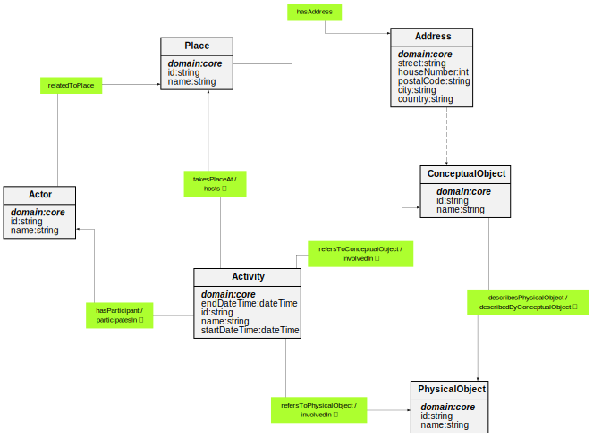

# Core Ontology


**Title:**  Core Ontology

**Description:**  The Catena-X core ontology is an activity-centric top-level ontology and enables the design of domain ontologies on the basis of main classes.

**Creator:**  [@obalandi](https://github.com/obalandi)

**Contributor:**  None

**Date:**  2023-05-05

**Version:**  1.9.4

**Imports:**  

**Link to ontology:**  https://w3id.org/catenax/ontology/core  
  
  

## Classes
  

|Name|Description|Datatype properties|Object properties|Subclass of|
| :--- | :--- | :--- | :--- | :--- |
|<span id="Activity">Activity</span>|This class comprises actions intentionally carried out by instances of Actor that result in changes of state in physical and conceptual objects.|[endDateTime](#endDateTime) , [id](#id) , [name](#name) , [startDateTime](#startDateTime) |[hasParticipant](#hasParticipant) , [refersToConceptualObject](#refersToConceptualObject) , [refersToPhysicalObject](#refersToPhysicalObject) , [takesPlaceAt](#takesPlaceAt) ||
|<span id="Actor">Actor</span>|This class comprises organization or people, either individually or in groups, who have the potential to perform intentional actions of kinds for which someone may be held responsible.|[id](#id) , [name](#name) |[participatesIn](#participatesIn) , [relatedToPlace](#relatedToPlace) ||
|<span id="Address">Address</span>|This class describes the legal address of places.|[street](#street) , [houseNumber](#houseNumber) , [postalCode](#postalCode) , [city](#city) , [country](#country) ||[ConceptualObject](#ConceptualObject) |
|<span id="ConceptualObject">ConceptualObject</span>|This class includes non-material products, human-produced data related to physical objects. The production of such information may have been supported by the use of technical tools.|[id](#id) , [name](#name) |[describesPhysicalObject](#describesPhysicalObject) , [involvedIn](#involvedIn) ||
|<span id="PhysicalObject">PhysicalObject</span>|This class includes objects of a material nature, which are documentation units and have physical boundaries.|[id](#id) , [name](#name) |[describedByConceptualObject](#describedByConceptualObject) , [involvedIn](#involvedIn) ||
|<span id="Place">Place</span>|The class Place is determined by reference to the position of objects such as buildings, cities, or special geographic markers.|[id](#id) , [name](#name) |[hasAddress](#hasAddress) , [hosts](#hosts) ||

## Data Properties
  

|Name|Description|Domain|Range|Subproperty of|
| :--- | :--- | :--- | :--- | :--- |
|<span id="endDateTime">endDateTime</span>|End time of the activity.|[Activity](#Activity) |xsd:dateTime ||
|<span id="id">id</span>|Unique identification of the exchanged Catena-X objects.|[Activity](#Activity) , [Place](#Place) , [Actor](#Actor) , [ConceptualObject](#ConceptualObject) , [PhysicalObject](#PhysicalObject) |xsd:string ||
|<span id="name">name</span>|Global name of an object.|[Activity](#Activity) , [Place](#Place) , [Actor](#Actor) , [ConceptualObject](#ConceptualObject) , [PhysicalObject](#PhysicalObject) |xsd:string ||
|<span id="startDateTime">startDateTime</span>|Start time of an activity.|[Activity](#Activity) |xsd:dateTime ||
|<span id="street">street</span>|Street name of alegal address.|[Address](#Address) |xsd:string ||
|<span id="houseNumber">houseNumber</span>|House number of a legal address.|[Address](#Address) |xsd:string ||
|<span id="postalCode">postalCode</span>|Postal code of a legal address.|[Address](#Address) |xsd:string ||
|<span id="city">city</span>|City name of a legal address.|[Address](#Address) |xsd:string ||
|<span id="country">country</span>|Country name of a legal address.|[Address](#Address) |xsd:string ||

## Object Properties
  

|Name|Descriptions|Domain|Range|Subproperty of|
| :--- | :--- | :--- | :--- | :--- |
|<span id="hasAddress">hasAddress</span>|Inverse of 'describes physical object' property.|[Place](#Place) |[Address](#Address) ||
|<span id="describedByConceptualObject">describedByConceptualObject</span>|Inverse of 'describes physical object' property.|[PhysicalObject](#PhysicalObject) |[ConceptualObject](#ConceptualObject) ||
|<span id="describesPhysicalObject">describesPhysicalObject</span>|This property describes that a conceptual object has a descriptive relationship to a physical object.|[ConceptualObject](#ConceptualObject) |[PhysicalObject](#PhysicalObject) ||
|<span id="hasParticipant">hasParticipant</span>|This property describes the active or passive participation of instances of Actors in an Activity.|[Activity](#Activity) |[Actor](#Actor) ||
|<span id="hosts">hosts</span>|Inverse of 'takes place at' property.|[Place](#Place) |[Activity](#Activity) ||
|<span id="involvedIn">involvedIn</span>|This property describes in which activity the physical object is involved.|[ConceptualObject](#ConceptualObject) , [PhysicalObject](#PhysicalObject) |[Activity](#Activity) ||
|<span id="participatesIn">participatesIn</span>|Inverse of 'has participant' property.|[Actor](#Actor) |[Activity](#Activity) ||
|<span id="refersToConceptualObject">refersToConceptualObject</span>|This property refers to actively or passively used conceptual objects in an Activity.|[Activity](#Activity) |[ConceptualObject](#ConceptualObject) ||
|<span id="refersToPhysicalObject">refersToPhysicalObject</span>|This property refers to actively or passively used physical objects in an Activity.|[Activity](#Activity) |[PhysicalObject](#PhysicalObject) ||
|<span id="relatedToPlace">relatedToPlace</span>|This property describes that an actor has a relationship to a particular place, such as reside, own, or manage, etc.|[Actor](#Actor) |[Place](#Place) ||
|<span id="takesPlaceAt">takesPlaceAt</span>|This property describes the spatial location of an activity.|[Activity](#Activity) |[Place](#Place) ||


```python
import Mdutils


mdFile = MdUtils(file_name='Example_Markdown',title='Markdown File Example')
mdFile.create_md_file()
```