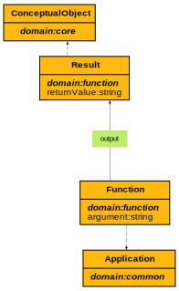

# Function Ontology

**Title:**  Function Ontology

**Description:**  Ontology for function invocations.

**Creator:**  [@drcgjung](https://github.com/drcgjung)

**Contributor:**  [@obalandi](https://github.com/obalandi)

**Date:**  2023-06-29

**Version:**  None

**Imports:**  file:common_ontology.ttl , file:core_ontology.ttl 

**Link to ontology:**  https://w3id.org/catenax/ontology/function  
  
  

## Classes
  

|Name|Description|Datatype properties|Object properties|Subclass of|
| :--- | :--- | :--- | :--- | :--- |
|Function|A function defines a calculation that is called through an API. For example, a prediction function for entered engine data.|[argument](#argument) |[output](#output) |[Application](./common_ontology.md#Application) |
|Result|Result describes the expected result of a function.|[returnValue](#returnValue) ||[ConceptualObject](./core_ontology.md#ConceptualObject) |

## Data Properties
  

|Name|Description|Domain|Range|Subproperty of|
| :--- | :--- | :--- | :--- | :--- |
|argument|Argument defines the input parameters of a function, and a function can have zero or more arguments.|[Function](#Function) |xsd:string ||
|returnValue|Return value describes the type of values returned by a function.|[Result](#Result) |xsd:string ||

## Object Properties
  

|Name|Descriptions|Domain|Range|Subproperty of|
| :--- | :--- | :--- | :--- | :--- |
|output|Refers to the result of a function.|[Function](#Function) |[Result](#Result) ||

## Annotation Properties
  

|Name|Descriptions|Domain|Range|Subproperty of|
| :--- | :--- | :--- | :--- | :--- |
|argumentConfigurationProperty|API configuration property for arguments.|[argument](#argument) |||
|argumentName|Determines the name or index of the function argument.|[argument](#argument) |xsd:string |[argumentConfigurationProperty](#argumentConfigurationProperty) |
|dataType|Determines the data type of an argument or return value.|[argument](#argument) |xsd:anyType |[argumentConfigurationProperty](#argumentConfigurationProperty) |
|default|Determines a default for the given argument which is taken if this is a mandatory argument|[argument](#argument) |xsd:anyType |[argumentConfigurationProperty](#argumentConfigurationProperty) |
|inputProperty|Determines a path/name in the input document under which all input arguments are encoded. Default is '.'|[argument](#argument) |xsd:string |[argumentConfigurationProperty](#argumentConfigurationProperty) |
|priority|Determines the priority with which the argument is processed. Default is '10'|[argument](#argument) |xsd:integer |[argumentConfigurationProperty](#argumentConfigurationProperty) |
|valuePath|Determines a path in the output response under which a return value is transmitted.|[argument](#argument) |xsd:string |[argumentConfigurationProperty](#argumentConfigurationProperty) |
|functionConfigurationProperty|API configuration property for Function.|[Function](#Function) |||
|batch|Determines maximal batch size for function invocations. Default is '1' which means that each invocation is done separately|[Function](#Function) |xsd:long |[functionConfigurationProperty](#functionConfigurationProperty) |
|callbackProperty|Determines a (set of) paths in the input document and the output response under which the callback address (see <https://w3id.org/catenax/ontology/function#callbackAddress>) and the referring callback id will be transmitted.|[Function](#Function) |xsd:string |[functionConfigurationProperty](#functionConfigurationProperty) |
|invocationIdProperty|Determines a (set of) paths in the input document under which the IRI of the invocation (instance of Function) will be transmitted.|[Function](#Function) |xsd:string |[functionConfigurationProperty](#functionConfigurationProperty) |
|invocationMethod|Determines the invocation method of the function in case that the target service provides several possibilities (DEFAULT, GET, POST-JSON , POST-JSON-MF , POST-XML , POST-XML-MF). |[Function](#Function) |xsd:string |[functionConfigurationProperty](#functionConfigurationProperty) |
|targetUri|The target URI of the function should resolve to some existing service (URL).||xsd:string |[functionConfigurationProperty](#functionConfigurationProperty) |
|resultConfigurationProperty|API configuration property for Result.|[Result](#Result) |||
|outputProperty|Determines a path/name in the output response under which all output arguments are encoded. Default is '.'|[Result](#Result) |xsd:string |[resultConfigurationProperty](#resultConfigurationProperty) |
|resultIdProperty|Determines a path in the output response under which the IRI of the result component will be transmitted.|[Result](#Result) |xsd:string |[resultConfigurationProperty](#resultConfigurationProperty) |
