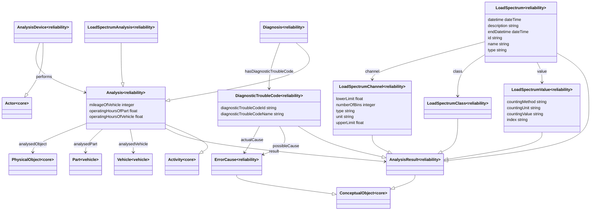

# Reliability Ontology

**Title:**  Reliability Ontology

**Description:**  None

**Creator:**  [@ZazraltMagic](https://github.com/ZazraltMagic)

**Contributor:**  [@Joerg-Schulz](https://github.com/Joerg-Schulz), [@bosserf](https://github.com/bosserf), [@obalandi](https://github.com/obalandi), [@drcgjung](https://github.com/drcgjung)

**Date:**  2023-02-21

**Version:**  1.11.0

**Imports:**  file:core_ontology.ttl , file:vehicle_ontology.ttl 

**Link to ontology:**  https://w3id.org/catenax/ontology/reliability  

## Classes
  

|Name|Description|Datatype properties|Object properties|Subclass of|
| :--- | :--- | :--- | :--- | :--- |
|Analysis|An analysis is an activity that includes all types of reliability and quality analyses.|[mileageOfVehicle](#mileageOfVehicle) , [operatingHoursOfPart](#operatingHoursOfPart) , [operatingHoursOfVehicle](#operatingHoursOfVehicle) |[analysedObject](#analysedObject) , [analysedPart](#analysedPart) , [analysedVehicle](#analysedVehicle) , [result](#result) |[Activity](./core_ontology.md#Activity) |
|AnalysisDevice|An analysis device, e.g. a diagnostic device, reads or calculates certain analysis results.||[performs](#performs) |[Actor](./core_ontology.md#Actor) |
|AnalysisResult|Results of the analysis activity.|||[ConceptualObject](./core_ontology.md#ConceptualObject) |
|Diagnosis|Vehicle diagnosis is the identification of a problem or the cause and location of a problem.||[hasDiagnosticTroubleCode](#hasDiagnosticTroubleCode) |[Analysis](#Analysis) |
|DiagnosticTroubleCode|Diagnostic Trouble Code, is a code used to diagnose malfunctions in a vehicle.|[diagnosticTroubleCodeId](#diagnosticTroubleCodeId) , [diagnosticTroubleCodeName](#diagnosticTroubleCodeName) |[actualCause](#actualCause) , [possibleCause](#possibleCause) |[AnalysisResult](#AnalysisResult) |
|ErrorCause|An analysis result can indicate possible and current error causes.  Example: Temperature values above a certain limit indicate overheating.|||[ConceptualObject](./core_ontology.md#ConceptualObject) |
|LoadSpectrum|Load spectrum is a 2d histogram that contains the load history of a vehicle, i.e. how a vehicle was used, for a given time period.|[datetime](#datetime) , [description](#description) , [endDatetime](#endDatetime) , [id](#id) , [name](#name) , [type](#type) |[channel](#channel) , [class](#class) , [value](#value) |[AnalysisResult](#AnalysisResult) |
|LoadSpectrumAnalysis|Load spectrum analysis is an analysis that calculates load spectrum values for a vehicle part.|||[Analysis](#Analysis) |
|LoadSpectrumChannel|The channel contains information about the axis of the 1d or 2d histogram.|[lowerLimit](#lowerLimit) , [numberOfBins](#numberOfBins) , [type](#type) , [unit](#unit) , [upperLimit](#upperLimit) ||[AnalysisResult](#AnalysisResult) |
|LoadSpectrumClass|The class contains information about the quantization states related to an axis.|||[AnalysisResult](#AnalysisResult) |
|LoadSpectrumValue|The values contains a list or a matrix with count values of the histogram.|[countingMethod](#countingMethod) , [countingUnit](#countingUnit) , [countingValue](#countingValue) , [index](#index) ||[AnalysisResult](#AnalysisResult) |

## Data Properties
  

|Name|Description|Domain|Range|Subproperty of|
| :--- | :--- | :--- | :--- | :--- |
|countingMethod|Counting method of Load spectrum.|[LoadSpectrumValue](#LoadSpectrumValue) |xsd:string ||
|countingUnit|Counting unit of load spectrum.|[LoadSpectrumValue](#LoadSpectrumValue) |xsd:string ||
|countingValue|Counting value of load spectrum.|[LoadSpectrumValue](#LoadSpectrumValue) |xsd:string ||
|datetime|Start of the measurement of load spectrum.|[LoadSpectrum](#LoadSpectrum) |xsd:dateTime ||
|description|Details about the load spectrum: who, what, where, when, how?|[LoadSpectrum](#LoadSpectrum) |xsd:string ||
|diagnosticTroubleCodeId|Id of diagnostic trouble code.|[DiagnosticTroubleCode](#DiagnosticTroubleCode) |xsd:string ||
|diagnosticTroubleCodeName|Name of diagnostic trouble code.|[DiagnosticTroubleCode](#DiagnosticTroubleCode) |xsd:string |[name](#name) |
|endDatetime|End of the measurement of load spectrum.|[LoadSpectrum](#LoadSpectrum) |xsd:dateTime ||
|id|Id of load spectrum.|[LoadSpectrum](#LoadSpectrum) |xsd:string ||
|index|Index of load spectrum values.|[LoadSpectrumValue](#LoadSpectrumValue) |xsd:string ||
|lowerLimit|Lower limit of load spectrum channel.|[LoadSpectrumChannel](#LoadSpectrumChannel) |xsd:float ||
|mileageOfVehicle|Mileage of analysed vehicle.|[Analysis](#Analysis) |xsd:integer ||
|name|Name of load spectrum|[LoadSpectrum](#LoadSpectrum) |xsd:string ||
|numberOfBins|Bins number of load spectrum channel.|[LoadSpectrumChannel](#LoadSpectrumChannel) |xsd:integer ||
|operatingHoursOfPart|Operating hours Of analysed part.|[Analysis](#Analysis) |xsd:float ||
|operatingHoursOfVehicle|Operating hours Of  vehicle.|[Analysis](#Analysis) |xsd:float ||
|type|Type of load spectrum.|[LoadSpectrum](#LoadSpectrum) , [LoadSpectrumChannel](#LoadSpectrumChannel) |xsd:string ||
|unit|Unit of load spectrum.|[LoadSpectrumChannel](#LoadSpectrumChannel) |xsd:string ||
|upperLimit|Upper limit of load spectrum.|[LoadSpectrumChannel](#LoadSpectrumChannel) |xsd:float ||

## Object Properties
  

|Name|Descriptions|Domain|Range|Subproperty of|
| :--- | :--- | :--- | :--- | :--- |
|actualCause|Refers to the actual error cause.|[DiagnosticTroubleCode](#DiagnosticTroubleCode) |[ErrorCause](#ErrorCause) ||
|analysedObject|Refers to analysed object.|[Analysis](#Analysis) |[PhysicalObject](./core_ontology.md#PhysicalObject) |[refersToPhysicalObject](./core_ontology.md#refersToPhysicalObject) |
|analysedPart|Refers to the analysed part.|[Analysis](#Analysis) |[Part](./vehicle_ontology.md#Part) |[analysedObject](#analysedObject) |
|analysedVehicle|Refers to the analysed vehicle.|[Analysis](#Analysis) |[Vehicle](./vehicle_ontology.md#Vehicle) |[analysedObject](#analysedObject) |
|performs|A device performs an analysis.|[AnalysisDevice](#AnalysisDevice) |[Analysis](#Analysis) ||
|channel|Refers to load spectrum channel.|[LoadSpectrum](#LoadSpectrum) |[LoadSpectrumChannel](#LoadSpectrumChannel) ||
|class|Refers to load spectrum class.|[LoadSpectrum](#LoadSpectrum) |[LoadSpectrumClass](#LoadSpectrumClass) ||
|hasDiagnosticTroubleCode|Refers to diagnostic trouble code.|[Diagnosis](#Diagnosis) |[DiagnosticTroubleCode](#DiagnosticTroubleCode) ||
|possibleCause|Refers to possible cause.|[DiagnosticTroubleCode](#DiagnosticTroubleCode) |[ErrorCause](#ErrorCause) ||
|result|Refers to analysis result.|[Analysis](#Analysis) |[AnalysisResult](#AnalysisResult) |[refersToConceptualObject](./core_ontology.md#refersToConceptualObject) |
|value|Refers to load spectrum value.|[LoadSpectrum](#LoadSpectrum) |[LoadSpectrumValue](#LoadSpectrumValue) ||
