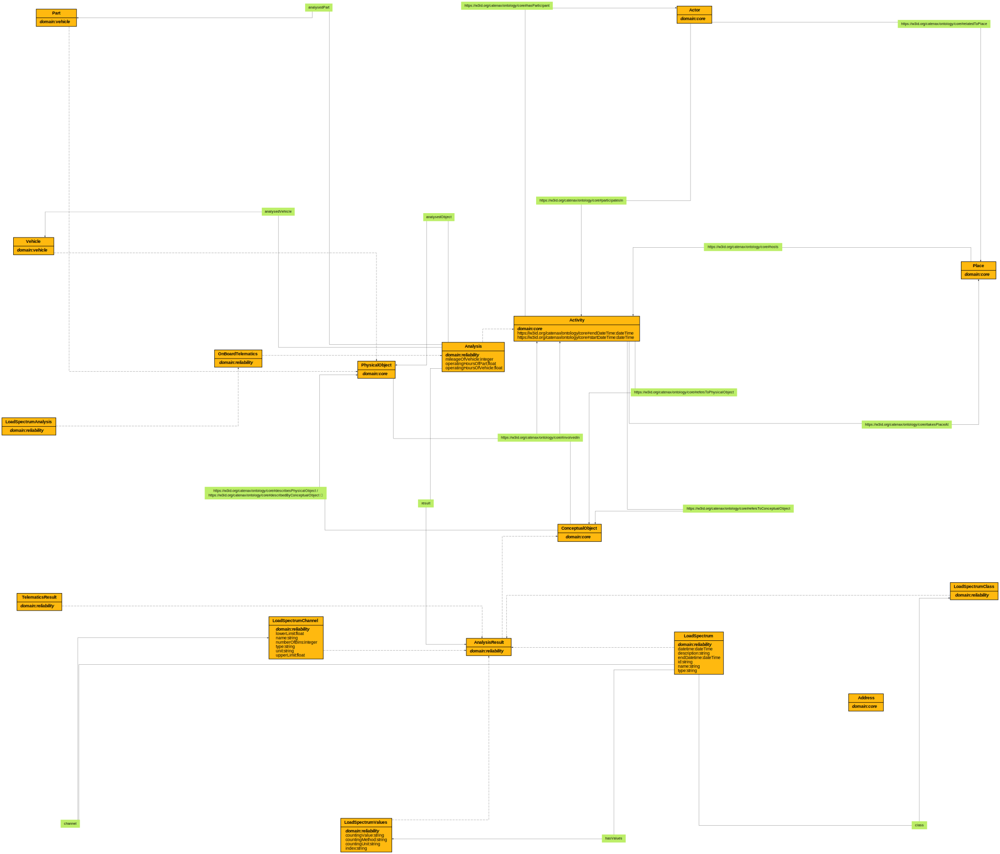

# Reliability Ontology

**Title:**  Reliability Ontology

**Description:**  Ontology for reliability.

**Creator:**  Zazralt Magic

**Contributor:**  Jörg Schulz, Rolf Bosse, Oguzhan Balandi 

**Date:**  2023-02-21

**Version:**  1.9.4

**Imports:**  file:core_ontology.ttl

**Link to ontology:**  https://w3id.org/catenax/ontology/reliability  
  
  

## Classes
  

|Name|Description|Datatype properties|Object properties|Subclass of|
| :--- | :--- | :--- | :--- | :--- |
|Analysis|None|[mileageOfVehicle](#mileageOfVehicle) , [operatingHoursOfPart](#operatingHoursOfPart) , [operatingHoursOfVehicle](#operatingHoursOfVehicle) |[analysedObject](#analysedObject) , [analysedPart](#analysedPart) , [analysedVehicle](#analysedVehicle) , [result](#result) |[Activity](./core_ontology.md#Activity) |
|AnalysisResult|None|||[ConceptualObject](./core_ontology.md#ConceptualObject) |
|LoadSpectrum|None|[datetime](#datetime) , [description](#description) , [endDatetime](#endDatetime) , [id](#id) , [name](#name) , [type](#type) |[channel](#channel) , [class](#class) , [hasValues](#hasValues) |[AnalysisResult](#AnalysisResult) |
|LoadSpectrumAnalysis|None|||[OnBoardTelematics](#OnBoardTelematics) |
|LoadSpectrumChannel|None|[lowerLimit](#lowerLimit) , [name](#name) , [numberOfBins](#numberOfBins) , [type](#type) , [unit](#unit) , [upperLimit](#upperLimit) ||[AnalysisResult](#AnalysisResult) |
|LoadSpectrumClass|None|||[AnalysisResult](#AnalysisResult) |
|LoadSpectrumValues|None|[countingValue](#countingValue) , [countingMethod](#countingMethod) , [countingUnit](#countingUnit) , [index](#index) ||[AnalysisResult](#AnalysisResult) |
|OnBoardTelematics|None|||[Analysis](#Analysis) |
|TelematicsResult|None|||[AnalysisResult](#AnalysisResult) |

## Data Properties
  

|Name|Description|Domain|Range|Subproperty of|
| :--- | :--- | :--- | :--- | :--- |
|channels|None||json:Object ||
|countingValue|None|[LoadSpectrumValues](#LoadSpectrumValues) |xsd:string ||
|countingMethod|None|[LoadSpectrumValues](#LoadSpectrumValues) |xsd:string ||
|countingUnit|None|[LoadSpectrumValues](#LoadSpectrumValues) |xsd:string ||
|datetime|None|[LoadSpectrum](#LoadSpectrum) |xsd:dateTime ||
|description|None|[LoadSpectrum](#LoadSpectrum) |xsd:string ||
|endDatetime|None|[LoadSpectrum](#LoadSpectrum) |xsd:dateTime ||
|id|None|[LoadSpectrum](#LoadSpectrum) |xsd:string ||
|index|None|[LoadSpectrumValues](#LoadSpectrumValues) |xsd:string ||
|lowerLimit|None|[LoadSpectrumChannel](#LoadSpectrumChannel) |xsd:float ||
|mileageOfVehicle|None|[Analysis](#Analysis) |xsd:integer ||
|name|None|[LoadSpectrum](#LoadSpectrum) , [LoadSpectrumChannel](#LoadSpectrumChannel) |xsd:string ||
|numberOfBins|None|[LoadSpectrumChannel](#LoadSpectrumChannel) |xsd:integer ||
|operatingHoursOfPart|None|[Analysis](#Analysis) |xsd:float ||
|operatingHoursOfVehicle|None|[Analysis](#Analysis) |xsd:float ||
|type|None|[LoadSpectrum](#LoadSpectrum) , [LoadSpectrumChannel](#LoadSpectrumChannel) |xsd:string ||
|unit|None|[LoadSpectrumChannel](#LoadSpectrumChannel) |xsd:string ||
|upperLimit|None|[LoadSpectrumChannel](#LoadSpectrumChannel) |xsd:float ||
|values|None||json:Object ||
|classes|None||json:Object ||

## Object Properties
  

|Name|Descriptions|Domain|Range|Subproperty of|
| :--- | :--- | :--- | :--- | :--- |
|analysedObject|None|[Analysis](#Analysis) |[PhysicalObject](./core_ontology.md#PhysicalObject) |[refersToPhysicalObject](./core_ontology.md#refersToPhysicalObject) |
|analysedPart|None|[Analysis](#Analysis) |[Part](./vehicle_ontology.md#Part) |[analysedObject](#analysedObject) |
|analysedVehicle|None|[Analysis](#Analysis) |[Vehicle](./vehicle_ontology.md#Vehicle) |[analysedObject](#analysedObject) |
|channel|None|[LoadSpectrum](#LoadSpectrum) |[LoadSpectrumChannel](#LoadSpectrumChannel) ||
|class|None|[LoadSpectrum](#LoadSpectrum) |[LoadSpectrumClass](#LoadSpectrumClass) ||
|result|None|[Analysis](#Analysis) |[AnalysisResult](#AnalysisResult) |[refersToConceptualObject](./core_ontology.md#refersToConceptualObject) |
|hasValues|None|[LoadSpectrum](#LoadSpectrum) |[LoadSpectrumValues](#LoadSpectrumValues) ||
