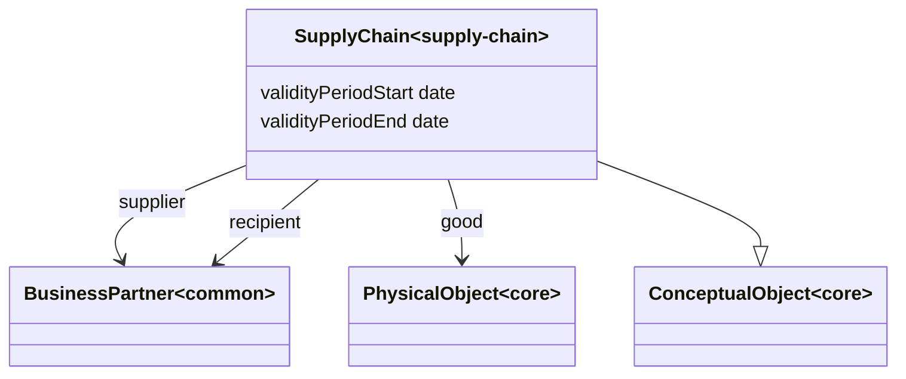

# Supply Chain Ontology

**Title:**  Supply Chain Ontology

**Description:**  Ontology for supply chains.

**Creator:**  [@drcgjung](https://github.com/drcgjung)

**Contributor:**  [@obalandi](https://github.com/obalandi)

**Date:**  2023-12-12

**Version:**  0.11.16

**Imports:**  file:core_ontology.ttl , file:common_ontology.ttl 

**Link to ontology:**  https://w3id.org/catenax/ontology/supply-chain  

## Classes
  

|Name|Description|Datatype properties|Object properties|Subclass of|
| :--- | :--- | :--- | :--- | :--- |
|SupplyChain|The Supply Chain relates consumers and a supplier.|[validityPeriod](#validityPeriod) , [validityPeriodStart](#validityPeriodStart) , [validityPeriodEnd](#validityPeriodEnd) |[supplier](#supplier) , [recipient](#recipient) , [good](#good) |[ConceptualObject](./core_ontology.md#ConceptualObject) |

## Data Properties
  

|Name|Description|Domain|Range|Subproperty of|
| :--- | :--- | :--- | :--- | :--- |
|validityPeriod|Defines the validity period.|[SupplyChain](#SupplyChain) |||
|validityPeriodStart|The start of validity.|[SupplyChain](#SupplyChain) |xsd:date |[validityPeriod](#validityPeriod) |
|validityPeriodEnd|The end of validity.|[SupplyChain](#SupplyChain) |xsd:date |[validityPeriod](#validityPeriod) |

## Object Properties
  

|Name|Descriptions|Domain|Range|Subproperty of|
| :--- | :--- | :--- | :--- | :--- |
|supplier|Refers to the supplier.|[SupplyChain](#SupplyChain) |[BusinessPartner](./common_ontology.md#BusinessPartner) ||
|recipient|Refers to the recipient.|[SupplyChain](#SupplyChain) |[BusinessPartner](./common_ontology.md#BusinessPartner) ||
|good|Refers to the goods in the supply chain.|[SupplyChain](#SupplyChain) |[PhysicalObject](./core_ontology.md#PhysicalObject) ||
