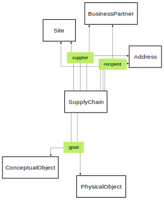

# Supply Chain Ontology


**Title:**  Supply Chain Ontology

**Description:**  Ontology for supply chains.

**Creator:**  [@drcgjung](https://github.com/drcgjung)

**Contributor:**  [@obalandi](https://github.com/obalandi)

**Date:**  2023-12-12

**Version:**  0.11.16

**Imports:**  file:core_ontology.ttl , file:common_ontology.ttl 

**Link to ontology:**  https://w3id.org/catenax/ontology/supply-chain  
  
  

## Data Properties
  

|Name|Description|Domain|Range|Subproperty of|
| :--- | :--- | :--- | :--- | :--- |
|<span id="validityPeriod">validityPeriod</span>|None|[SupplyChain](#SupplyChain) |||
|<span id="validityPeriodStart">validityPeriodStart</span>|None|[SupplyChain](#SupplyChain) |xsd:date |[validityPeriod](#validityPeriod) |
|<span id="validityPeriodEnd">validityPeriodEnd</span>|None|[SupplyChain](#SupplyChain) |xsd:date |[validityPeriod](#validityPeriod) |

## Object Properties
  

|Name|Descriptions|Domain|Range|Subproperty of|
| :--- | :--- | :--- | :--- | :--- |
|<span id="supplier">supplier</span>|None|[SupplyChain](#SupplyChain) |[BusinessPartner](./common_ontology.md#BusinessPartner) , [Site](./common_ontology.md#Site) , [Address](./common_ontology.md#Address) ||
|<span id="recipient">recipient</span>|None|[SupplyChain](#SupplyChain) |[BusinessPartner](./common_ontology.md#BusinessPartner) , [Site](./common_ontology.md#Site) , [Address](./common_ontology.md#Address) ||
|<span id="good">good</span>|None|[SupplyChain](#SupplyChain) |[PhysicalObject](./core_ontology.md#PhysicalObject) , [ConceptualObject](./core_ontology.md#ConceptualObject) ||


```python
import Mdutils


mdFile = MdUtils(file_name='Example_Markdown',title='Markdown File Example')
mdFile.create_md_file()
```