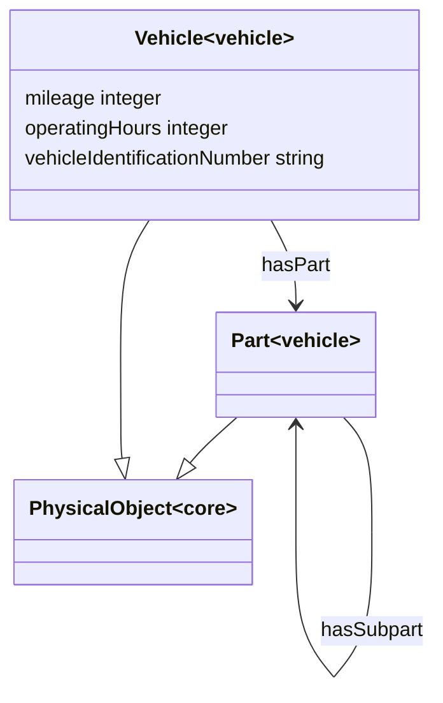

# Vehicle Ontology

**Title:**  Vehicle Ontology

**Description:**  Ontology for vehicles in the automotive industry.

**Creator:**  [@ZazraltMagic](https://github.com/ZazraltMagic)

**Contributor:**  [@Joerg-Schulz](https://github.com/Joerg-Schulz), [@bosserf](https://github.com/bosserf), [@obalandi](https://github.com/obalandi), [@drcgjung](https://github.com/drcgjung)

**Date:**  2023-02-21

**Version:**  1.11.0

**Imports:**  file:core_ontology.ttl 

**Link to ontology:**  https://w3id.org/catenax/ontology/vehicle  

## Classes
  

|Name|Description|Datatype properties|Object properties|Subclass of|
| :--- | :--- | :--- | :--- | :--- |
|Part|A part in the automotive context is a component of a vehicle. Parts may have sub-parts that perform specific sub-functions.||[hasSubpart](#hasSubpart) , [isPartOf](#isPartOf) , [isSubpartOf](#isSubpartOf) |[PhysicalObject](./core_ontology.md#PhysicalObject) |
|Vehicle|A vehicle is a motor-powered road vehicle that transports people or cargo .|[mileage](#mileage) , [operatingHours](#operatingHours) , [vehicleIdentificationNumber](#vehicleIdentificationNumber) |[hasPart](#hasPart) |[PhysicalObject](./core_ontology.md#PhysicalObject) |

## Data Properties
  

|Name|Description|Domain|Range|Subproperty of|
| :--- | :--- | :--- | :--- | :--- |
|mileage|The current mileage of the vehicle in km.|[Vehicle](#Vehicle) |xsd:integer |[stateInformation](#stateInformation) |
|operatingHours|The current operating hours of the vehicle in h.|[Vehicle](#Vehicle) |xsd:integer |[stateInformation](#stateInformation) |
|vehicleIdentificationNumber|The Vehicle Identification Number  is a unique serial number used by the automotive industry to identify individual motor vehicles.|[Vehicle](#Vehicle) |xsd:string ||

## Object Properties
  

|Name|Descriptions|Domain|Range|Subproperty of|
| :--- | :--- | :--- | :--- | :--- |
|hasPart|Refes to parts of vehicle|[Vehicle](#Vehicle) |[Part](#Part) ||
|hasSubpart|Refes to parts of main vehicle parts.|[Part](#Part) |[Part](#Part) ||
|isPartOf|Inverse of 'hasPart' property.|[Part](#Part) |[Vehicle](#Vehicle) ||
|isSubpartOf|Inverse of 'hasSubpart' property.|[Part](#Part) |[Part](#Part) ||
