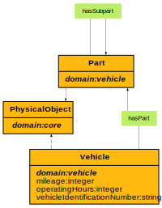

# Vehicle Ontology

**Title:**  Vehicle Ontology

**Description:**  Ontology for vehicles in the automotive industry.

**Creator:**  Zazralt Magic

**Contributor:**  Rolf Bosse, Jörg Schulz, Oguzhan Balandi

**Date:**  2023-02-21

**Version:**  1.9.4  
  
  

## Classes
  

|Name|Description|Datatype properties|Object properties|Subclass of|
| :--- | :--- | :--- | :--- | :--- |
|EClassType|None|[classification](#classification) , [irdi](#irdi) ||[https://w3id.org/catenax/ontology/core#ConceptualObject](#https://w3id.org/catenax/ontology/core#ConceptualObject) |
|Part|None|[batteryInformation](#batteryInformation) , [bodyInformation](#bodyInformation) , [chassisInformation](#chassisInformation) , [engineInformation](#engineInformation) , [partInformation](#partInformation) , [powertrainInformation](#powertrainInformation) , [suspensionInformation](#suspensionInformation) |[hasSubpart](#hasSubpart) , [isPartOf](#isPartOf) , [isSubpartOf](#isSubpartOf) , [supplier](#supplier) |[https://w3id.org/catenax/ontology/core#PhysicalObject](#https://w3id.org/catenax/ontology/core#PhysicalObject) |
|Vehicle|None|[acceleration](#acceleration) , [adblueTankCapacity](#adblueTankCapacity) , [age](#age) , [airConditioningType](#airConditioningType) , [assistanceSystem](#assistanceSystem) , [batteryCapacity](#batteryCapacity) , [batteryInformation](#batteryInformation) , [batteryWeight](#batteryWeight) , [bodyInformation](#bodyInformation) , [bodyStyle](#bodyStyle) , [bore](#bore) , [brand](#brand) , [breaking](#breaking) , [camshaftValvetrainConfiguration](#camshaftValvetrainConfiguration) , [cargoInformation](#cargoInformation) , [cargoVolume](#cargoVolume) , [chargingTime](#chargingTime) , [chassisInformation](#chassisInformation) , [clutchType](#clutchType) , [co2Emissions](#co2Emissions) , [co2EmissionsWltp](#co2EmissionsWltp) , [communicationInformation](#communicationInformation) , [configuration](#configuration) , [curbWeight](#curbWeight) , [developmentSeries](#developmentSeries) , [dragCoefficient](#dragCoefficient) , [driveWheelType](#driveWheelType) , [dryWeight](#dryWeight) , [electricConsumption](#electricConsumption) , [electricPower](#electricPower) , [electricRange](#electricRange) , [electricRangeWltp](#electricRangeWltp) , [emissionClass](#emissionClass) , [engineAlignment](#engineAlignment) , [engineAspiration](#engineAspiration) , [engineCompressionRatio](#engineCompressionRatio) , [engineDisplacement](#engineDisplacement) , [engineFamily](#engineFamily) , [engineForm](#engineForm) , [engineFuelInjection](#engineFuelInjection) , [engineGeneration](#engineGeneration) , [engineInformation](#engineInformation) , [engineManufacturer](#engineManufacturer) , [engineMaxPower](#engineMaxPower) , [engineMaxTorque](#engineMaxTorque) , [engineName](#engineName) , [enginePerformanceClass](#enginePerformanceClass) , [enginePosition](#enginePosition) , [engineSeries](#engineSeries) , [engineTypeCode](#engineTypeCode) , [engineVersion](#engineVersion) , [euEnergyLabel](#euEnergyLabel) , [euroCarSegment](#euroCarSegment) , [expectedLifetime](#expectedLifetime) , [expectedLifetimeMileage](#expectedLifetimeMileage) , [exteriorColor](#exteriorColor) , [frontBrakeDiscDiameter](#frontBrakeDiscDiameter) , [frontSpringType](#frontSpringType) , [frontSuspension](#frontSuspension) , [fuelConsumptionCity](#fuelConsumptionCity) , [fuelConsumptionCombined](#fuelConsumptionCombined) , [fuelConsumptionHighway](#fuelConsumptionHighway) , [fuelEfficiency](#fuelEfficiency) , [fuelInformation](#fuelInformation) , [fuelTankCapacity](#fuelTankCapacity) , [fuelType](#fuelType) , [grossVehicleMass](#grossVehicleMass) , [groundClearance](#groundClearance) , [hasAutomaticHeadLights](#hasAutomaticHeadLights) , [hasFogLights](#hasFogLights) , [hasModem](#hasModem) , [hasNavigation](#hasNavigation) , [hasRadio](#hasRadio) , [height](#height) , [infotainmentInformation](#infotainmentInformation) , [interiorColor](#interiorColor) , [interiorInformation](#interiorInformation) , [interiorType](#interiorType) , [length](#length) , [lifetimeInformation](#lifetimeInformation) , [lightingInformation](#lightingInformation) , [location](#location) , [manufacturerKeyNumber](#manufacturerKeyNumber) , [maxAxleLoad](#maxAxleLoad) , [maxPayload](#maxPayload) , [maxSpeed](#maxSpeed) , [maxTowingCapacity](#maxTowingCapacity) , [mileage](#mileage) , [model](#model) , [modelArchitecture](#modelArchitecture) , [modelEndOfProduction](#modelEndOfProduction) , [modelGeneration](#modelGeneration) , [modelInformation](#modelInformation) , [modelSeries](#modelSeries) , [modelStartOfProduction](#modelStartOfProduction) , [modelVariant](#modelVariant) , [numberOfAirbags](#numberOfAirbags) , [numberOfAxles](#numberOfAxles) , [numberOfCylinders](#numberOfCylinders) , [numberOfDoors](#numberOfDoors) , [numberOfDriveAxles](#numberOfDriveAxles) , [numberOfForwardGears](#numberOfForwardGears) , [numberOfPassengers](#numberOfPassengers) , [numberOfSeatRows](#numberOfSeatRows) , [numberOfSeats](#numberOfSeats) , [numberOfStandingPlaces](#numberOfStandingPlaces) , [numberOfValves](#numberOfValves) , [operatingHours](#operatingHours) , [passengerVolume](#passengerVolume) , [performanceInformation](#performanceInformation) , [powertrainInformation](#powertrainInformation) , [powertrainLayout](#powertrainLayout) , [previousVehicleModel](#previousVehicleModel) , [range](#range) , [rangeWltp](#rangeWltp) , [rearSpringType](#rearSpringType) , [rearSuspension](#rearSuspension) , [registrationAuthority](#registrationAuthority) , [registrationDate](#registrationDate) , [registrationInformation](#registrationInformation) , [registrationLocation](#registrationLocation) , [registrationOwner](#registrationOwner) , [registrationPlate](#registrationPlate) , [rim](#rim) , [roadNoise](#roadNoise) , [safetyInformation](#safetyInformation) , [specialUsage](#specialUsage) , [stateDateTime](#stateDateTime) , [stateInformation](#stateInformation) , [stationaryNoise](#stationaryNoise) , [steeringType](#steeringType) , [steeringWheelPosition](#steeringWheelPosition) , [stroke](#stroke) , [suspensionInformation](#suspensionInformation) , [tire](#tire) , [tongueWeight](#tongueWeight) , [trailerWeight](#trailerWeight) , [transmission](#transmission) , [trunkVolume](#trunkVolume) , [turningRadius](#turningRadius) , [typeCode](#typeCode) , [typeCodeNumber](#typeCodeNumber) , [vehicleIdentificationNumber](#vehicleIdentificationNumber) , [warrantyInformation](#warrantyInformation) , [warrantyMaxDuration](#warrantyMaxDuration) , [warrantyMaxMileage](#warrantyMaxMileage) , [weight](#weight) , [weightTotal](#weightTotal) , [wheelbase](#wheelbase) , [width](#width) , [worldManufacturerCountry](#worldManufacturerCountry) , [worldManufacturerId](#worldManufacturerId) , [worldManufacturerName](#worldManufacturerName) , [worldManufacturerRegion](#worldManufacturerRegion) |[hasPart](#hasPart) , [isVariantOf](#isVariantOf) , [manufacturer](#manufacturer) |[https://w3id.org/catenax/ontology/core#PhysicalObject](#https://w3id.org/catenax/ontology/core#PhysicalObject) |
|VehicleModel|None|||[https://w3id.org/catenax/ontology/core#ConceptualObject](#https://w3id.org/catenax/ontology/core#ConceptualObject) |

## Data Properties
  

|Name|Description|Domain|Range|Subproperty of|
| :--- | :--- | :--- | :--- | :--- |
|acceleration|None|[Vehicle](#Vehicle) |xml : integer |[performanceInformation](#performanceInformation) |
|adblueTankCapacity|None|[Vehicle](#Vehicle) |xml : double |[fuelInformation](#fuelInformation) |
|age|None|[Vehicle](#Vehicle) |xml : integer |[stateInformation](#stateInformation) |
|airConditioningType|None|[Vehicle](#Vehicle) |xml : string |[interiorInformation](#interiorInformation) |
|assemblyCountry|None||xml : string |[productionInformation](#productionInformation) |
|assemblyPlant|None||xml : string |[productionInformation](#productionInformation) |
|assistanceSystem|None|[Vehicle](#Vehicle) |xml : string |[suspensionInformation](#suspensionInformation) |
|batteryCapacity|None|[Vehicle](#Vehicle) |xml : integer |[batteryInformation](#batteryInformation) |
|batteryInformation|None|[Part](#Part) , [Vehicle](#Vehicle) |||
|batteryType|None||xml : string |[batteryInformation](#batteryInformation) |
|batteryWeight|None|[Vehicle](#Vehicle) |xml : integer |[batteryInformation](#batteryInformation) |
|bodyInformation|None|[Part](#Part) , [Vehicle](#Vehicle) |||
|bodyStyle|None|[Vehicle](#Vehicle) |xml : string |[bodyInformation](#bodyInformation) |
|bore|None|[Vehicle](#Vehicle) |xml : double |[engineInformation](#engineInformation) |
|brand|None|[Vehicle](#Vehicle) |xml : string |[modelInformation](#modelInformation) |
|breaking|None|[Vehicle](#Vehicle) |xml : integer |[performanceInformation](#performanceInformation) |
|camshaftValvetrainConfiguration|None|[Vehicle](#Vehicle) |xml : string |[engineInformation](#engineInformation) |
|cargoInformation|None|[Vehicle](#Vehicle) |||
|cargoVolume|None|[Vehicle](#Vehicle) |xml : double |[cargoInformation](#cargoInformation) |
|chargingTime|None|[Vehicle](#Vehicle) |xml : double |[batteryInformation](#batteryInformation) |
|chassisInformation|None|[Part](#Part) , [Vehicle](#Vehicle) |||
|classification|None|[EClassType](#EClassType) |xml : string ||
|clutchType|None|[Vehicle](#Vehicle) |xml : string |[powertrainInformation](#powertrainInformation) |
|co2Emissions|None|[Vehicle](#Vehicle) |xml : integer |[fuelInformation](#fuelInformation) |
|co2EmissionsWltp|None|[Vehicle](#Vehicle) |xml : integer |[fuelInformation](#fuelInformation) |
|communicationInformation|None|[Vehicle](#Vehicle) |||
|configuration|None|[Vehicle](#Vehicle) |xml : string ||
|countryOption|None||xml : string |[productionInformation](#productionInformation) |
|curbWeight|None|[Vehicle](#Vehicle) |xml : double |[bodyInformation](#bodyInformation) |
|deliveryCountry|None||xml : string |[productionInformation](#productionInformation) |
|deliveryDate|None||xml : date |[productionInformation](#productionInformation) |
|deliveryPrice|None||xml : integer |[productionInformation](#productionInformation) |
|description|None||xml : string ||
|developmentSeries|None|[Vehicle](#Vehicle) |xml : string |[modelInformation](#modelInformation) |
|dragCoefficient|None|[Vehicle](#Vehicle) |xml : double |[bodyInformation](#bodyInformation) |
|driveWheelType|None|[Vehicle](#Vehicle) |xml : string |[powertrainInformation](#powertrainInformation) |
|dryWeight|None|[Vehicle](#Vehicle) |xml : double |[bodyInformation](#bodyInformation) |
|electricConsumption|None|[Vehicle](#Vehicle) |xml : double |[batteryInformation](#batteryInformation) |
|electricPower|None|[Vehicle](#Vehicle) |xml : integer |[batteryInformation](#batteryInformation) |
|electricRange|None|[Vehicle](#Vehicle) |xml : integer |[performanceInformation](#performanceInformation) |
|electricRangeWltp|None|[Vehicle](#Vehicle) |xml : integer |[performanceInformation](#performanceInformation) |
|emissionClass|None|[Vehicle](#Vehicle) |xml : string |[fuelInformation](#fuelInformation) |
|engineAlignment|None|[Vehicle](#Vehicle) |xml : string |[engineInformation](#engineInformation) |
|engineAspiration|None|[Vehicle](#Vehicle) |xml : string |[engineInformation](#engineInformation) |
|engineCompressionRatio|None|[Vehicle](#Vehicle) |xml : double |[engineInformation](#engineInformation) |
|engineDisplacement|None|[Vehicle](#Vehicle) |xml : double |[engineInformation](#engineInformation) |
|engineFamily|None|[Vehicle](#Vehicle) |xml : string |[engineInformation](#engineInformation) |
|engineForm|None|[Vehicle](#Vehicle) |xml : string |[engineInformation](#engineInformation) |
|engineFuelInjection|None|[Vehicle](#Vehicle) |xml : string |[engineInformation](#engineInformation) |
|engineGeneration|None|[Vehicle](#Vehicle) |xml : string |[engineInformation](#engineInformation) |
|engineInformation|None|[Part](#Part) , [Vehicle](#Vehicle) |||
|engineManufacturer|None|[Vehicle](#Vehicle) |xml : string |[engineInformation](#engineInformation) |
|engineMaxPower|None|[Vehicle](#Vehicle) |xml : double |[engineInformation](#engineInformation) |
|engineMaxTorque|None|[Vehicle](#Vehicle) |xml : double |[engineInformation](#engineInformation) |
|engineName|None|[Vehicle](#Vehicle) |xml : string |[engineInformation](#engineInformation) |
|enginePerformanceClass|None|[Vehicle](#Vehicle) |xml : string |[engineInformation](#engineInformation) |
|enginePosition|None|[Vehicle](#Vehicle) |xml : string |[engineInformation](#engineInformation) |
|engineSeries|None|[Vehicle](#Vehicle) |xml : string |[engineInformation](#engineInformation) |
|engineTypeCode|None|[Vehicle](#Vehicle) |xml : string |[engineInformation](#engineInformation) |
|engineVersion|None|[Vehicle](#Vehicle) |xml : string |[engineInformation](#engineInformation) |
|euEnergyLabel|None|[Vehicle](#Vehicle) |xml : string |[fuelInformation](#fuelInformation) |
|euroCarSegment|None|[Vehicle](#Vehicle) |xml : string |[bodyInformation](#bodyInformation) |
|expectedLifetime|None|[Vehicle](#Vehicle) |xml : integer |[lifetimeInformation](#lifetimeInformation) |
|expectedLifetimeMileage|None|[Vehicle](#Vehicle) |xml : integer |[lifetimeInformation](#lifetimeInformation) |
|exteriorColor|None|[Vehicle](#Vehicle) |xml : string |[bodyInformation](#bodyInformation) |
|frontBrakeDiscDiameter|None|[Vehicle](#Vehicle) |xml : double |[bodyInformation](#bodyInformation) |
|frontSpringType|None|[Vehicle](#Vehicle) |xml : string |[suspensionInformation](#suspensionInformation) |
|frontSuspension|None|[Vehicle](#Vehicle) |xml : string |[suspensionInformation](#suspensionInformation) |
|fuelConsumptionCity|None|[Vehicle](#Vehicle) |xml : double |[fuelInformation](#fuelInformation) |
|fuelConsumptionCombined|None|[Vehicle](#Vehicle) |xml : double |[fuelInformation](#fuelInformation) |
|fuelConsumptionHighway|None|[Vehicle](#Vehicle) |xml : double |[fuelInformation](#fuelInformation) |
|fuelEfficiency|None|[Vehicle](#Vehicle) |xml : double |[fuelInformation](#fuelInformation) |
|fuelInformation|None|[Vehicle](#Vehicle) |||
|fuelTankCapacity|None|[Vehicle](#Vehicle) |xml : double |[fuelInformation](#fuelInformation) |
|fuelType|None|[Vehicle](#Vehicle) |xml : string |[fuelInformation](#fuelInformation) |
|grossVehicleMass|None|[Vehicle](#Vehicle) |xml : double |[cargoInformation](#cargoInformation) |
|groundClearance|None|[Vehicle](#Vehicle) |xml : double |[bodyInformation](#bodyInformation) |
|hasAutomaticHeadLights|None|[Vehicle](#Vehicle) |xml : boolean |[lightingInformation](#lightingInformation) |
|hasFogLights|None|[Vehicle](#Vehicle) |xml : boolean |[lightingInformation](#lightingInformation) |
|hasModem|None|[Vehicle](#Vehicle) |xml : boolean |[communicationInformation](#communicationInformation) |
|hasNavigation|None|[Vehicle](#Vehicle) |xml : boolean |[infotainmentInformation](#infotainmentInformation) |
|hasRadio|None|[Vehicle](#Vehicle) |xml : boolean |[infotainmentInformation](#infotainmentInformation) |
|height|None|[Vehicle](#Vehicle) |xml : double |[bodyInformation](#bodyInformation) |
|id|None||xml : string |[partInformation](#partInformation) |
|infotainmentInformation|None|[Vehicle](#Vehicle) |||
|interiorColor|None|[Vehicle](#Vehicle) |xml : string |[interiorInformation](#interiorInformation) |
|interiorInformation|None|[Vehicle](#Vehicle) |||
|interiorType|None|[Vehicle](#Vehicle) |xml : string |[interiorInformation](#interiorInformation) |
|irdi|None|[EClassType](#EClassType) |xml : string ||
|length|None|[Vehicle](#Vehicle) |xml : double |[bodyInformation](#bodyInformation) |
|lifetimeInformation|None|[Vehicle](#Vehicle) |||
|lightingInformation|None|[Vehicle](#Vehicle) |||
|listPrice|None||xml : integer |[productionInformation](#productionInformation) |
|location|None|[Vehicle](#Vehicle) |xml : string |[stateInformation](#stateInformation) |
|manufacturerKeyNumber|None|[Vehicle](#Vehicle) |xml : string |[registrationInformation](#registrationInformation) |
|maxAxleLoad|None|[Vehicle](#Vehicle) |xml : double |[cargoInformation](#cargoInformation) |
|maxPayload|None|[Vehicle](#Vehicle) |xml : double |[cargoInformation](#cargoInformation) |
|maxSpeed|None|[Vehicle](#Vehicle) |xml : integer |[performanceInformation](#performanceInformation) |
|maxTowingCapacity|None|[Vehicle](#Vehicle) |xml : double |[cargoInformation](#cargoInformation) |
|mileage|None|[Vehicle](#Vehicle) |xml : integer |[stateInformation](#stateInformation) |
|model|None|[Vehicle](#Vehicle) |xml : string |[modelInformation](#modelInformation) |
|modelArchitecture|None|[Vehicle](#Vehicle) |xml : string |[modelInformation](#modelInformation) |
|modelEndOfProduction|None|[Vehicle](#Vehicle) |xml : date |[modelInformation](#modelInformation) |
|modelGeneration|None|[Vehicle](#Vehicle) |xml : integer |[modelInformation](#modelInformation) |
|modelInformation|None|[Vehicle](#Vehicle) |||
|modelSeries|None|[Vehicle](#Vehicle) |xml : string |[modelInformation](#modelInformation) |
|modelStartOfProduction|None|[Vehicle](#Vehicle) |xml : date |[modelInformation](#modelInformation) |
|modelVariant|None|[Vehicle](#Vehicle) |xml : string |[modelInformation](#modelInformation) |
|name|None||xml : string ||
|number|None||xml : string |[partInformation](#partInformation) |
|numberOfAirbags|None|[Vehicle](#Vehicle) |xml : integer |[safetyInformation](#safetyInformation) |
|numberOfAxles|None|[Vehicle](#Vehicle) |xml : integer |[chassisInformation](#chassisInformation) |
|numberOfCylinders|None|[Vehicle](#Vehicle) |xml : integer |[engineInformation](#engineInformation) |
|numberOfDoors|None|[Vehicle](#Vehicle) |xml : integer |[bodyInformation](#bodyInformation) |
|numberOfDriveAxles|None|[Vehicle](#Vehicle) |xml : integer |[chassisInformation](#chassisInformation) |
|numberOfForwardGears|None|[Vehicle](#Vehicle) |xml : integer |[powertrainInformation](#powertrainInformation) |
|numberOfPassengers|None|[Vehicle](#Vehicle) |xml : integer |[interiorInformation](#interiorInformation) |
|numberOfSeatRows|None|[Vehicle](#Vehicle) |xml : integer |[interiorInformation](#interiorInformation) |
|numberOfSeats|None|[Vehicle](#Vehicle) |xml : integer |[interiorInformation](#interiorInformation) |
|numberOfStandingPlaces|None|[Vehicle](#Vehicle) |xml : integer |[interiorInformation](#interiorInformation) |
|numberOfValves|None|[Vehicle](#Vehicle) |xml : integer |[engineInformation](#engineInformation) |
|operatingHours|None|[Vehicle](#Vehicle) |xml : integer |[stateInformation](#stateInformation) |
|orderDate|None||xml : date |[productionInformation](#productionInformation) |
|partInformation|None|[Part](#Part) |||
|passengerVolume|None|[Vehicle](#Vehicle) |xml : double |[cargoInformation](#cargoInformation) |
|performanceInformation|None|[Vehicle](#Vehicle) |||
|powertrainInformation|None|[Part](#Part) , [Vehicle](#Vehicle) |||
|powertrainLayout|None|[Vehicle](#Vehicle) |xml : string |[powertrainInformation](#powertrainInformation) |
|previousVehicleModel|None|[Vehicle](#Vehicle) |xml : string |[modelInformation](#modelInformation) |
|productionDate|None||xml : date |[productionInformation](#productionInformation) |
|productionInformation|None||||
|productionYear|None||xml : integer |[productionInformation](#productionInformation) |
|purchaseDate|None||xml : date |[productionInformation](#productionInformation) |
|purchasePrice|None||xml : integer |[productionInformation](#productionInformation) |
|range|None|[Vehicle](#Vehicle) |xml : integer |[performanceInformation](#performanceInformation) |
|rangeWltp|None|[Vehicle](#Vehicle) |xml : integer |[performanceInformation](#performanceInformation) |
|rearSpringType|None|[Vehicle](#Vehicle) |xml : string |[suspensionInformation](#suspensionInformation) |
|rearSuspension|None|[Vehicle](#Vehicle) |xml : string |[suspensionInformation](#suspensionInformation) |
|registrationAuthority|None|[Vehicle](#Vehicle) |xml : string |[registrationInformation](#registrationInformation) |
|registrationDate|None|[Vehicle](#Vehicle) |xml : date |[registrationInformation](#registrationInformation) |
|registrationInformation|None|[Vehicle](#Vehicle) |||
|registrationLocation|None|[Vehicle](#Vehicle) |xml : string |[registrationInformation](#registrationInformation) |
|registrationOwner|None|[Vehicle](#Vehicle) |xml : string |[registrationInformation](#registrationInformation) |
|registrationPlate|None|[Vehicle](#Vehicle) |xml : string |[registrationInformation](#registrationInformation) |
|rim|None|[Vehicle](#Vehicle) |xml : string |[suspensionInformation](#suspensionInformation) |
|roadNoise|None|[Vehicle](#Vehicle) |xml : integer |[performanceInformation](#performanceInformation) |
|safetyInformation|None|[Vehicle](#Vehicle) |||
|specialUsage|None|[Vehicle](#Vehicle) |xml : string ||
|stateDateTime|None|[Vehicle](#Vehicle) |xml : dateTime |[stateInformation](#stateInformation) |
|stateInformation|None|[Vehicle](#Vehicle) |||
|stationaryNoise|None|[Vehicle](#Vehicle) |xml : integer |[performanceInformation](#performanceInformation) |
|steeringType|None|[Vehicle](#Vehicle) |xml : string |[powertrainInformation](#powertrainInformation) |
|steeringWheelPosition|None|[Vehicle](#Vehicle) |xml : string |[powertrainInformation](#powertrainInformation) |
|stroke|None|[Vehicle](#Vehicle) |xml : double |[engineInformation](#engineInformation) |
|suspensionInformation|None|[Part](#Part) , [Vehicle](#Vehicle) |||
|tire|None|[Vehicle](#Vehicle) |xml : string |[suspensionInformation](#suspensionInformation) |
|tongueWeight|None|[Vehicle](#Vehicle) |xml : double |[cargoInformation](#cargoInformation) |
|trailerWeight|None|[Vehicle](#Vehicle) |xml : double |[cargoInformation](#cargoInformation) |
|transmission|None|[Vehicle](#Vehicle) |xml : string |[powertrainInformation](#powertrainInformation) |
|trunkVolume|None|[Vehicle](#Vehicle) |xml : double |[cargoInformation](#cargoInformation) |
|turningRadius|None|[Vehicle](#Vehicle) |xml : double |[bodyInformation](#bodyInformation) |
|typeCode|None|[Vehicle](#Vehicle) |xml : string ||
|typeCodeNumber|None|[Vehicle](#Vehicle) |xml : string |[registrationInformation](#registrationInformation) |
|vehicleIdentificationNumber|None|[Vehicle](#Vehicle) |xml : string ||
|version|None||xml : string |[partInformation](#partInformation) |
|warrantyInformation|None|[Vehicle](#Vehicle) |||
|warrantyMaxDuration|None|[Vehicle](#Vehicle) |xml : integer |[warrantyInformation](#warrantyInformation) |
|warrantyMaxMileage|None|[Vehicle](#Vehicle) |xml : integer |[warrantyInformation](#warrantyInformation) |
|weight|None|[Vehicle](#Vehicle) |xml : double |[bodyInformation](#bodyInformation) |
|weightTotal|None|[Vehicle](#Vehicle) |xml : double |[cargoInformation](#cargoInformation) |
|wheelbase|None|[Vehicle](#Vehicle) |xml : double |[bodyInformation](#bodyInformation) |
|width|None|[Vehicle](#Vehicle) |xml : double |[bodyInformation](#bodyInformation) |
|worldManufacturerCountry|None|[Vehicle](#Vehicle) |xml : string |[productionInformation](#productionInformation) |
|worldManufacturerId|None|[Vehicle](#Vehicle) |xml : string |[productionInformation](#productionInformation) |
|worldManufacturerName|None|[Vehicle](#Vehicle) |xml : string |[productionInformation](#productionInformation) |
|worldManufacturerRegion|None|[Vehicle](#Vehicle) |xml : string |[productionInformation](#productionInformation) |

## Object Properties
  

|Name|Descriptions|Domain|Range|Subproperty of|
| :--- | :--- | :--- | :--- | :--- |
|eClassType|None|[https://w3id.org/catenax/ontology/core#PhysicalObject](#https://w3id.org/catenax/ontology/core#PhysicalObject) |[EClassType](#EClassType) |[describedByConceptualObject](./core_ontology.md#describedByConceptualObject) |
|hasPart|None|[Vehicle](#Vehicle) |[Part](#Part) ||
|hasSubpart|None|[Part](#Part) |[Part](#Part) ||
|isPartOf|None|[Part](#Part) |[Vehicle](#Vehicle) ||
|isSubpartOf|None|[Part](#Part) |[Part](#Part) ||
|isVariantOf|None|[Vehicle](#Vehicle) |[VehicleModel](#VehicleModel) |[describedByConceptualObject](./core_ontology.md#describedByConceptualObject) |
|supplier|None|[Part](#Part) |http://www.w3.org/2000/01/rdf-schema#Resource ||
|manufacturer|None|[Vehicle](#Vehicle) |http://www.w3.org/2000/01/rdf-schema#Resource ||
