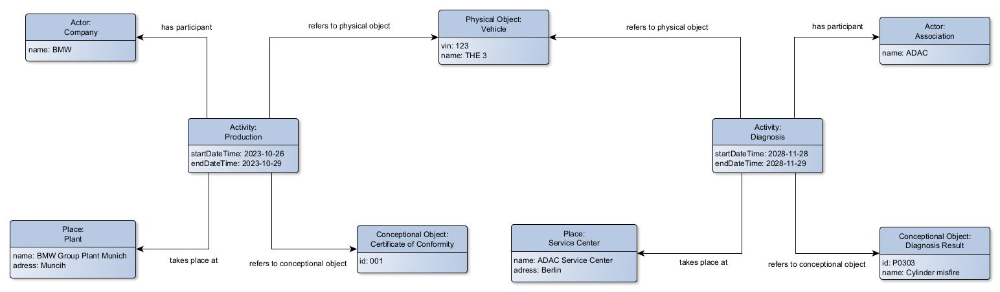

# Core Ontology

The Catena-X ontologies consist of the Core Ontology and the Domain Ontologies. The Core Ontology is based on activity-oriented patterns and the Domain Ontologies build on these patterns. In parallel, a taxonomy exists in which the vocabularies created in the Catena-X project are captured in a structured way to realize Domain Ontologies. This taxonomy is not a standard and is used to realize the use cases. It can therefore be replaced or extended by other taxonomies.  

Catena-X Core Ontology is a practical tool for information integration for the automotive industry. In Catena-X, product data is exchanged over the entire lifecycle from development to recycling. In each of these phases, activities on the product generate new information, e.g. manufacturing data, quality data, battery passport. This information needs to be linked semantically along the lifecycle to gain new knowledge and insights to realize traceability, sustainability, ensuring carbon footprint. For this reason, the Core Ontology is activity-centric. The activities are in the center of the modeling and the all other necessary information is attached to the activities.

**Example:**

This concept enables the exploration of complex questions along the product lifecycle using different and distributed data sets. Both general queries such as "get all activities for vehicle with VIN number 123" and specific queries such as "get all diagnostic activities and results of vehicle with VIN number 123" are possible.

<pre>

</pre>

**Visual representation of the core ontology:**

The core ontology consists of the classes Activity, Actor, Place, Physical and Conceptual Object. These are the main entities that are shared in Catene-X. In order to realize secure and consistent exchange and networking, it is necessary that these entities have a [persistent identifier](#Persistent-Identifier), name and access roles.

### Activity

* **Description:**
This class comprises actions intentionally carried out by instances of Actor that result in changes of state in physical and conceptual objects.

* **Properties:**	
    * **has participant:** This property describes the active or passive participation of instances of Actors in an Activity.
    * **takes place at:** This property describes the spatial location of an activity. 
    * **refers to physical object:** This property refers to actively or passively used physical objects in an Activity.
    * **refers to conceptual object:** This property refers to actively or passively used conceptual objects in an Activity.
    * **start datetime:** Start time of the activity.
    * **end datetime:** End time of the activity.

* **Example:**	
    * Manufacture of a part.
    * Maintenance of several parts.
    * Recycling of a vehicle.

### Actor

* **Description:**
This class comprises organization or people, either individually or in groups, who have the potential to perform intentional actions of kinds for which someone may be held responsible.

* **Properties:**	
    * **participates in:** Inverse of 'has participant'
    * **related to place:** This property describes that an actor has a relationship to a particular place, such as reside, own, or manage, etc. 

* **Example:**	
    * Vehicle Manufacturer BMW
    * Automobile Association ADAC

### Physical Object

* **Description:**
This class includes objects of a material nature, which are documentation units and have physical boundaries.

* **Properties:**	
    * **involved in:** This property describes in which activity the physical object is involved.

* **Example:**	
    * Vehicle
    * Part

### Conceptual Object

* **Description:**
This class includes non-material products, human-produced data related to physical objects. The production of such information may have been supported by the use of technical tools.

* **Properties:**	
    * **involved in:** This property describes in which activity the conceptual object is involved.
    * **describes physical object:** This property describes that a conceptual object has a descriptive relationship to a physical object.

* **Example:**	
    * Used technique in production
    * Battery passport
    * CAD design of the part

### Place

* **Description:**
The class Place is determined by reference to the position of objects such as buildings, cities, or special geographic markers.

* **Properties:**	
    * **hosts:** This property refers to the hosted activities in a place.

* **Example:**	
    * BMW Plant Munich.
    * Rubber plantation in Phuket

<pre>

</pre>

## Persistent Identifier
A persistent identifier (PI or PID) is a long-lasting reference to a document, file, web page, or other digital object. Most PIDs have a unique identifier which is linked to the current address of the metadata or content.

* Uniform Resource Name (URN)

<pre>

</pre>

## Taxonomy
All vocabularies used in the Catena-X Knowledge Agent approach to describe data are captured as concepts in a SKOS taxonomy. The way the taxonomy is used in the development of the domain ontology is defined by the [ontology modeling rules](ontology_modelling_rules.md/#Don't-create-subclasses-if-possible).

<pre>

</pre>

## Domain Ontologies
Domain ontologies are specific extensions of the core ontology, in which a specific domain is described in detail. Currently the following ontologies are developed and used in the Knowledge Agent Kit in different skills.

* Part ontology
* Vehicle ontology
* Vehicle Information Ontology
* Diagnosis ontology
* Load spectrum ontology
* ...
